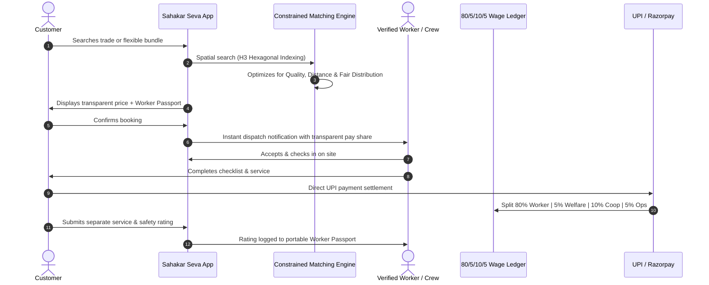

<div align="center">

# 🤝 Sahakar Seva

**A Cooperative-Owned Digital Marketplace for Household & Community Services**

[](https://nextjs.org/)
[](https://www.typescriptlang.org/)
[](https://tailwindcss.com/)
[](https://sih.gov.in/)
[](#the-805105-wage-formula)

**Smart India Hackathon 2026 | Problem Statement ID: 26089**  
**Theme:** Agriculture, FoodTech and Rural Development | **Category:** Software  
**Team:** CodeKrafters | **Team ID:** 119065

[Live Demo](sahakar-seva-opal.vercel.app) • [Architecture](#technology-stack) • [Matching Formula](#the-matching-formula) • [Run Instructions](#-quick-start--run-instructions)

---

</div>

## 📌 Executive Overview

**Sahakar Seva** connects skilled workers already organized under India's labour cooperative federations and societies—electricians, plumbers, carpenters, painters, domestic helpers, caregivers, drivers, gardeners, cleaners, and technicians—with households and institutions that need their services.

Private gig platforms dominate this market, but extract **30% to 40%** in corporate commissions. Workers who generate that value have no ownership stake, no safety net, and no say in algorithmic decisions. Sahakar Seva fixes that imbalance by fundamentally restructuring platform ownership. 

Following the proven path of the Ministry of Cooperation's **Bharat Taxi** (operated by Sahakar Taxi Cooperative Ltd at zero commission in mobility), Sahakar Seva brings digital platform cooperativism to the multi-billion-dollar household and community services sector.

---

## 💡 Why This Matters

- **Booming Gig Economy:** India's gig workforce expanded from **7.7 million** in 2021 to over **12 million** in 2025, projected to reach **23.5 million** by 2029–30.
- **Financial Precarity:** Over **90%** of gig workers report having zero savings or emergency safety nets.
- **Predatory Take-Rates:** Major venture-backed platforms have faced recurring worker strikes over 30–35% commissions and opaque, automated account suspensions.
- **Proven Alternative:** The Ministry of Cooperation demonstrated that cooperative digital platforms work through *Bharat Taxi*. Sahakar Seva scales this cooperative architecture to trades, caregiving, and facility management.

---

## ⚖️ The 80/5/10/5 Economic Formula

Every transaction on Sahakar Seva follows a democratically audited, transparent wage ledger:

| Share | Allocation | Purpose |
|:---:|:---|:---|
| **80%** | **Direct Worker Net** | Disbursed immediately to the professional's bank account with zero platform take-rate. |
| **5%** | **Social Security & Insurance** | Powers pooled accident coverage, health hospitalization, maternity aid, and crisis relief. |
| **10%** | **Cooperative Treasury** | Builds collective capital for tools, equipment, guild training centers, and member dividends. |
| **5%** | **Platform Maintenance** | Covers cloud hosting, maps, SMS/voice gateways, and digital infrastructure upkeep. |

---

## ✨ Key Features & 9 Core USPs

1. **Tiered Verification & Guild Certification:** Aadhaar / e-Shram identity validation, NSDC skill credentials, police verification, and peer community attestations across 3 verification tiers.
2. **Worker Passport:** A portable, worker-owned digital credential holding verified skills, certifications, work history, and split service/safety ratings that travels with the worker rather than being locked inside proprietary platforms.
3. **Collective Bargaining Dashboard (USP 1):** Real-time spatial demand heatmaps where trade guilds democratically vote on minimum wage floors and surge caps.
4. **Gender-First Safety & Emergency Circle (USP 2):** Instant SOS panic triggers, safe-time chaperone filters for women workers, and a dedicated Red/Yellow admin escalation queue.
5. **Cooperative Micro-Equity & Asset Ownership (USP 3):** Workers accrue equity points and cooperative shares with annual dividend distributions.
6. **Neighborhood Batch & Community Coordination (USP 4):** Group discount calculations for Resident Welfare Associations (RWAs) and societies that optimize travel routes and cut transit pollution by 40%.
7. **Multi-Service Bundling (USP 5):** AI-clustered multi-trade packages (e.g., Deep Clean + Plumbing Check + AC Service) with combo savings and synchronized dispatch.
8. **Worker Algorithmic Appeal & Peer Jury (USP 6):** Zero automated account deactivations. Every dispute or retaliatory review is arbitrated by an empaneled 15-member worker jury with binding democratic voting.
9. **Heritage Skills Marketplace (USP 7):** Certified master artisans in generational crafts (Mughal tilework, Burma teak joinery, Bidriware metalwork, Warli murals, Chunam lime plaster) receive specialized cultural equity premiums.
10. **Crisis Income Redistribution Engine (USP 8):** Automatic solidarity income top-ups triggered during monsoons, heatwaves, or pollution bans, weighted democratically between rating and household vulnerability.
11. **Multi-Person Team Contracts (USP 9):** Enterprise and facility booking for coordinated multi-worker crews with per-person pay shares and route milestone tracking.
12. **Explainable AI Matching Engine:** Constrained optimization balancing service quality, worker earnings, travel distance, and workload balance with SHAP/LIME style attribution.
13. **Multilingual & Voice-First:** Native vernacular interfaces powered by Bhashini for speech-to-intent in regional Indian languages.
14. **ONDC Network Interoperability:** Every verified worker's catalog is discoverable across any ONDC-compliant buyer application nationally.

---

## 🔄 How a Booking Works



---

## 🧮 The Matching Formula

Sahakar Seva replaces exploitative profit-maximizing algorithms with a multi-objective constrained optimization function:

$$\text{Maximize } \Phi = \alpha \cdot \mathcal{Q}_{\text{quality}} + \beta \cdot \mathcal{E}_{\text{earnings}} - \gamma \cdot \mathcal{T}_{\text{travel}} - \delta \cdot \mathcal{W}_{\text{imbalance}}$$

Where:
- $\mathcal{Q}_{\text{quality}}$: Verified guild certifications and peer-audited customer rating.
- $\mathcal{E}_{\text{earnings}}$: Historical earnings deficit (prioritizes active workers below the Minimum Earnings Guarantee).
- $\mathcal{T}_{\text{travel}}$: Transit distance and fuel expenditure calculated via H3 geospatial indexing.
- $\mathcal{W}_{\text{imbalance}}$: Penalty term preventing job monopolization by top algorithmic outliers.
- $\alpha, \beta, \gamma, \delta$: Tunable parameters adjusted transparently by elected cooperative board members.

---

## 🛠️ Technology Stack

| Layer | Technologies |
|---|---|
| **Frontend Framework** | **Next.js 14** (App Router, Server Components & Client Hydration) |
| **Language & Runtime** | **TypeScript 5.6**, Node.js 18+ |
| **Styling & Design System** | **Tailwind CSS**, Glassmorphism, Cooperative Brand Tokens (`coop-green`, `forest-green`, `sage-green`) |
| **UI Components & Icons** | **Lucide React**, Custom Micro-Interactions, Toast Alerts, Modal Portals |
| **Data Visualization** | **Recharts** (Earnings bars, GMV trends, Wage distribution pies) |
| **Geospatial & Routing** | **Uber H3** Hexagonal Spatial Indexing, Google Maps API, Mappls (DIGIPIN) |
| **State & Auth Context** | React Context API (`AuthContext`, `ToastContext`), Persistent Sessions & Secure Cookies |
| **Matching & AI Models** | Graph Neural Networks (Trust Network), Gradient Boosting (Demand Forecast), SHAP/LIME Attribution |
| **Voice & Localization** | **Bhashini** (National Language Translation Mission) |
| **Payments & Invoicing** | **Razorpay**, Instant UPI Settlement, GST-Compliant Tax Invoices |

---

## 📋 Problem Statement Requirement Mapping

| Requirement (PS 26089) | How Sahakar Seva Meets It | Implementation Path |
|---|---|---|
| **Service Provider Registration & Verification** | 3-tier guild onboarding: Aadhaar ID, NSDC trade license, and peer community vouching. | [`src/app/auth/signup`](file:///c:/Users/NITYA%20SRI%20DEEPAK%20RAJ/OneDrive/Desktop/sahakar%20seva/src/app/auth/signup/page.tsx), [`src/app/admin/workers`](file:///c:/Users/NITYA%20SRI%20DEEPAK%20RAJ/OneDrive/Desktop/sahakar%20seva/src/app/admin/workers/page.tsx) |
| **Worker Skill Profiling & Reputation** | Portable Worker Passport with verified trades, micro-tests, and separate safety/service scores. | [`src/app/workers/[id]`](file:///c:/Users/NITYA%20SRI%20DEEPAK%20RAJ/OneDrive/Desktop/sahakar%20seva/src/app/workers/%5Bid%5D/page.tsx) |
| **Customer Booking & Scheduling** | Flexible 6-step booking wizard, multi-service bundles, and emergency Instahelp slots. | [`src/app/bookings/create`](file:///c:/Users/NITYA%20SRI%20DEEPAK%20RAJ/OneDrive/Desktop/sahakar%20seva/src/app/bookings/create/page.tsx), [`src/app/services/bundle`](file:///c:/Users/NITYA%20SRI%20DEEPAK%20RAJ/OneDrive/Desktop/sahakar%20seva/src/app/services/bundle/page.tsx) |
| **RWA & Society Batch Scheduling** | Hyperlocal batch booking with tiered household group discounts and route clustering. | [`src/app/bookings/batch-create`](file:///c:/Users/NITYA%20SRI%20DEEPAK%20RAJ/OneDrive/Desktop/sahakar%20seva/src/app/bookings/batch-create/page.tsx) |
| **Digital Payments & Transparent Invoicing** | Itemized 80/5/10/5 wage ledger with downloadable B2B GST tax statements. | [`src/app/earnings`](file:///c:/Users/NITYA%20SRI%20DEEPAK%20RAJ/OneDrive/Desktop/sahakar%20seva/src/app/earnings/page.tsx), [`src/app/business/dashboard`](file:///c:/Users/NITYA%20SRI%20DEEPAK%20RAJ/OneDrive/Desktop/sahakar%20seva/src/app/business/dashboard/page.tsx) |
| **Worker Welfare & Insurance** | 5% welfare pool accounting, cash-free claims management, and Ayushman Bharat links. | [`src/app/dashboard/insurance`](file:///c:/Users/NITYA%20SRI%20DEEPAK%20RAJ/OneDrive/Desktop/sahakar%20seva/src/app/dashboard/insurance/page.tsx) |
| **Dispute Resolution & Fair Governance** | Algorithmic appeal jury with 15-member worker peer tribunals for penalty strikes. | [`src/app/appeal`](file:///c:/Users/NITYA%20SRI%20DEEPAK%20RAJ/OneDrive/Desktop/sahakar%20seva/src/app/appeal/page.tsx), [`src/app/admin/arbitration-panel`](file:///c:/Users/NITYA%20SRI%20DEEPAK%20RAJ/OneDrive/Desktop/sahakar%20seva/src/app/admin/arbitration-panel/page.tsx) |
| **Crisis Income Redistribution** | Solidarity income top-ups during climate disruptions using democratic vulnerability sliders. | [`src/app/admin/crisis`](file:///c:/Users/NITYA%20SRI%20DEEPAK%20RAJ/OneDrive/Desktop/sahakar%20seva/src/app/admin/crisis/page.tsx) |
| **Cooperative Federation Administration** | Executive portal tracking GMV, compliance audits, contractor rosters, and trade analytics. | [`src/app/admin/reports`](file:///c:/Users/NITYA%20SRI%20DEEPAK%20RAJ/OneDrive/Desktop/sahakar%20seva/src/app/admin/reports/page.tsx), [`src/app/admin/compliance`](file:///c:/Users/NITYA%20SRI%20DEEPAK%20RAJ/OneDrive/Desktop/sahakar%20seva/src/app/admin/compliance/page.tsx) |

---

## 🚀 Quick Start & Run Instructions

Follow these steps to run **Sahakar Seva** locally on your machine:

### 1. Prerequisites
- **Node.js**: v18.17.0 or higher
- **npm**: v9.0.0 or higher (or `pnpm` / `yarn`)
- **Git**: Installed and configured

### 2. Clone the Repository
```bash
git clone https://github.com/NityaSriDeepakRaj/SahakarSeva.git
cd SahakarSeva
```

### 3. Install Dependencies
```bash
npm install
```

### 4. Run Development Server
```bash
npm run dev
```

Open [http://localhost:3000](http://localhost:3000) (or `http://localhost:3001` if port 3000 is occupied) in your browser.

### 5. Build for Production
To test the optimized production build:
```bash
# Compile and build all 41 routes
npm run build

# Start the production server
npm run start
```

### 6. Code Verification & Type Checking
To run type validation across the entire TypeScript codebase:
```bash
npx tsc --noEmit
```

---

## 🗺️ Key Routes & Tour Guide

| Section | Route | What to Explore |
|---|---|---|
| **Landing Page** | `/` | 80/5/10/5 interactive wage calculator, hero slider, trade carousel, and mission stats. |
| **Role Dashboard** | `/dashboard` | Click the top banner to hot-swap between **Worker (Sunita)**, **Customer (Rahul)**, and **Admin (Priya)** views. |
| **Collective Bargaining** | `/dashboard/bargaining` | Live demand heatmaps and worker democratic wage consensus voting (USP 1). |
| **Worker Safety** | `/dashboard/safety` | Real-time SOS panic trigger and night safe-time chaperone toggle (USP 2). |
| **Batch / RWA Booking** | `/bookings/batch-create` | RWA household coordinator and group savings calculator (USP 4). |
| **Multi-Service Bundling** | `/services/bundle` | AI-clustered packages with combo discounts and single checkout (USP 5). |
| **AI Custom Service** | `/services/custom` | Natural language job parser extracting skills and worker bidding stream (USP 9). |
| **Heritage Skills** | `/services/heritage-skills` | Traditional artisan crafts with cultural preservation context (USP 7). |
| **Enterprise Portal** | `/business/dashboard` | Corporate facility contracts, team dispatch rosters, and B2B GST tax invoices. |
| **Arbitration Tribunal** | `/admin/arbitration-panel` | 15-worker peer jury voting progress and algorithmic sanction overturn actions (USP 6). |
| **Crisis Redistribution** | `/admin/crisis` | Emergency reserve balance and rating vs. vulnerability allocation sliders (USP 8). |
| **Worker Management** | `/admin/workers` | 3-tier guild credential endorsements, background check audits, and inspection modal. |

---

## 🛡️ Risk Mitigation & Security Matrix

| Risk Category | Potential Vulnerability | Sahakar Seva Mitigation |
|---|---|---|
| **Digital Literacy** | Complex smartphone forms prevent worker adoption. | Voice-first conversational booking via Bhashini; local cooperative guild assistance hubs. |
| **Data Privacy** | Location and personal worker data harvested or leaked. | Ephemeral location escrow purged post-service; no advertising tracking; compliance with DPDP Act 2023. |
| **Income Volatility** | Seasonal monsoon/heatwave demand dry-spells. | Minimum Earnings Guarantee (MEG) powered by the 5% cooperative crisis redistribution reserve fund. |
| **Algorithmic Bias** | Opaque AI ratings unilaterally disabling livelihoods. | 15-worker peer arbitration jury with binding veto power over automated platform sanctions. |
| **Regulatory Risk** | Classification disputes under gig labour laws. | Full compliance with the *Code on Social Security 2020* and Multi-State Cooperative Societies legislation. |

---

## 👥 Team CodeKrafters

| Role | Details |
|---|---|
| **Team Name** | **CodeKrafters** |
| **Team ID** | **119065** |
| **Event** | **Smart India Hackathon 2026** |
| **Problem Statement** | **PS 26089 (Cooperative Gig Services Marketplace)** |

---

## 📄 License

This repository is submitted as part of **Smart India Hackathon 2026**.  
Licensed under the [MIT License](LICENSE).

<div align="center">
  <p><b>Built with dignity for India's skilled workforce 🇮🇳</b></p>
</div>
